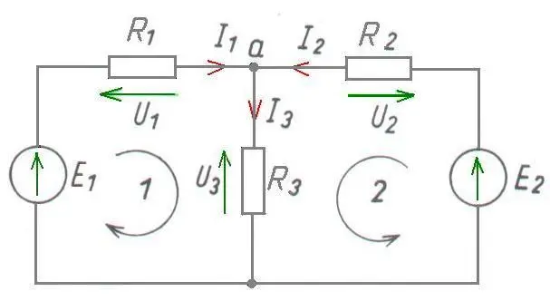

# Analiza dwuwęzłowego obwodu prądu stałego metodą praw Kirchhoffa

## 1. Opis układu

Rozważamy liniowy obwód prądu stałego zawierający:

- dwa idealne źródła napięcia: $E_1$, $E_2$,
- trzy rezystory: $R_1$, $R_2$, $R_3$,
- jeden węzeł górny oznaczony jako $a$,
- jeden węzeł dolny (przyjęty jako odniesienie — masa).

Rezystor $R_3$ stanowi gałąź wspólną dwóch oczek.

## 2. Przyjęcie zwrotów prądów

Przyjmujemy:

- $I_1$ — prąd przez $R_1$, skierowany do węzła $a$,
- $I_2$ — prąd przez $R_2$, skierowany do węzła $a$,
- $I_3$ — prąd przez $R_3$, skierowany w dół.

Dolny węzeł przyjmujemy jako potencjał odniesienia:

$$
V_{\text{dolny}} = 0
$$

## 3. Zapis równań Kirchhoffa

### 3.1. I prawo Kirchhoffa (KCL)

W węźle $a$:

$$
I_1 + I_2 - I_3 = 0
$$

### 3.2. II prawo Kirchhoffa (KVL)

Poniższy rysunek ilustruje zapis oczkowy (II prawo Kirchhoffa) dla rozważanego układu:

#### Oczko lewe

$$
E_1 - R_1 I_1 - R_3 I_3 = 0
$$

#### Oczko prawe

$$
E_2 - R_2 I_2 - R_3 I_3 = 0
$$

## 4. Układ równań

Otrzymujemy:

$$
\begin{cases}
I_1 + I_2 - I_3 = 0 \\
E_1 - R_1 I_1 - R_3 I_3 = 0 \\
E_2 - R_2 I_2 - R_3 I_3 = 0
\end{cases}
$$

## 5. Rozwiązanie symboliczne

Z równań oczkowych:

$$
I_1 = \frac{E_1 - R_3 I_3}{R_1},
\qquad
I_2 = \frac{E_2 - R_3 I_3}{R_2}.
$$

Podstawiamy do KCL:

$$
\frac{E_1 - R_3 I_3}{R_1} + \frac{E_2 - R_3 I_3}{R_2} = I_3.
$$

Po pomnożeniu przez $R_1 R_2$:

$$
R_2(E_1 - R_3 I_3) + R_1(E_2 - R_3 I_3) = R_1 R_2 I_3.
$$

Po zebraniu wyrazów z $I_3$:

$$
E_1 R_2 + E_2 R_1 = I_3 \left(R_1 R_2 + R_1 R_3 + R_2 R_3\right).
$$

Wprowadzamy skrót:

$$
D = R_1 R_2 + R_1 R_3 + R_2 R_3.
$$

## 6. Wyniki końcowe

### Prąd w gałęzi środkowej

$$
I_3 = \frac{E_1 R_2 + E_2 R_1}{D}.
$$

### Prąd przez $R_1$

$$
I_1 = \frac{E_1 (R_2 + R_3) - E_2 R_3}{D}.
$$

### Prąd przez $R_2$

$$
I_2 = \frac{E_2 (R_1 + R_3) - E_1 R_3}{D}.
$$

Sprawdzenie:

$$
I_1 + I_2 = I_3.
$$

## 7. Napięcie węzła $a$

Ponieważ dolny węzeł ma potencjał $0\,\text{V}$:

$$
V_a = R_3 I_3,
$$

czyli

$$
V_a = \frac{R_3 (E_1 R_2 + E_2 R_1)}{D}.
$$

## 8. Interpretacja fizyczna

- $R_3$ sprzęga oba oczka.
- Jeśli $E_1 = E_2$ oraz $R_1 = R_2$, układ jest symetryczny.
- Jeżeli jedno ze źródeł jest większe, wymusza przepływ prądu przez gałąź środkową.

## 9. Alternatywne metody rozwiązania

Ten sam układ można rozwiązać:

1. metodą węzłową — jedno równanie dla $V_a$,
2. metodą oczkową — dwa prądy oczkowe,
3. w zapisie macierzowym:

$$
A \mathbf{I} = \mathbf{E}.
$$

## 10. Wnioski dydaktyczne

- Liczba równań = liczba niewiadomych.
- Wybór węzła odniesienia jest dowolny.
- Wszystkie metody prowadzą do identycznych wyników.
- Algebraicznie mianownik $D$ reprezentuje „sprzężoną” rezystancję układu.

## 11. (Opcjonalnie) Dalsze kroki

- Wersja rozszerzona z pełnym wyprowadzeniem macierzowym.
- Sekcja „typowe błędy studentów”.
- Wersja minimalistyczna (slajdowa).
- Wersja LaTeX gotowa do PDF.
